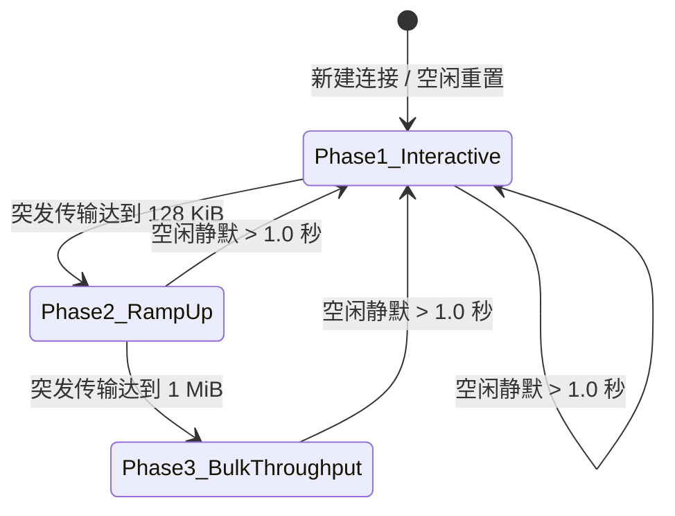
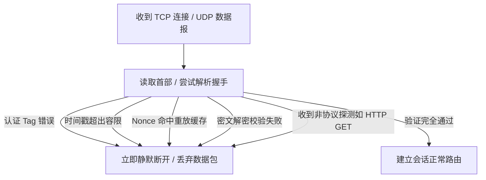
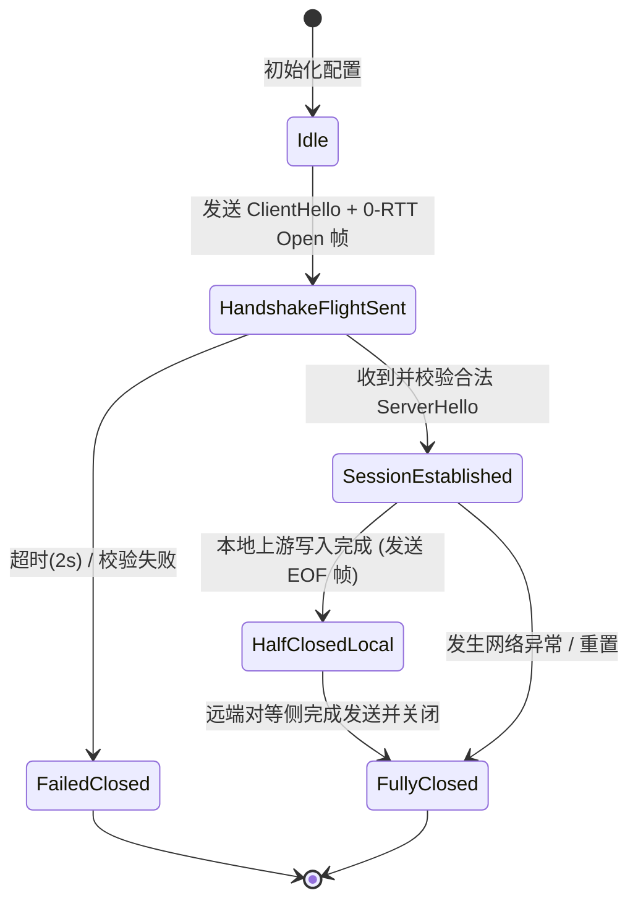
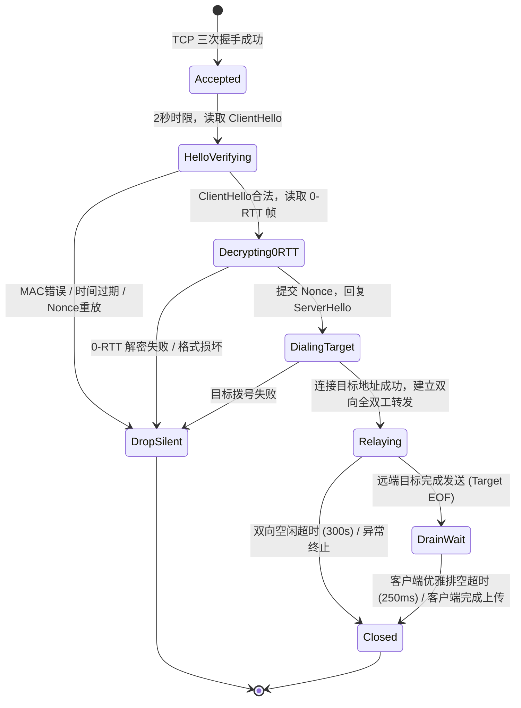

# Chitanda 协议详细设计规范 (Protocol Specification v2.0)

本文档为 Chitanda 隐蔽代理传输协议的官方权威规范（RFC-Style Protocol Specification）。涵盖协议密码学原语、密钥派生机制、五种底层传输载体线格式（Wire Format）、防主动探测机制、抗重放滑动窗口、带内 EOF 状态机、自适应分帧算法及全生命周期状态机。

---

## 1. 协议概述与设计哲学 (Overview & Design Philosophy)

Chitanda 是一种专为对抗深度包检测（DPI）、主动嗅探扫描（Active Probing）以及侧信道指纹识别设计的高性能、全双工安全代理协议。

### 1.1 核心设计目标

1. **零主动探测预言机 (Zero Active-Probe Oracle)**：
   - 协议在面对任何未经认证的连接、错误格式握手包或探测扫描（如傲盾/运营商主动下发的 HTTP `GET /`、TLS ClientHello、畸变探测数据）时，**绝不回送任何应用层明文或错误响应**（严禁返回 HTTP 400/404/500 等指纹特征页面）。
   - 探测连接将被直接静默丢弃（Silent Drop）或直接断开，消除所有可用于机器学习分类的应答侧信道。
2. **多态握手与长度指纹消除 (Polymorphic Handshake & Dynamic Padding)**：
   - 握手包长度采用基于预共享密钥（PSK）混淆的动态随机填充，彻底破坏固定首包大小特征。
   - 握手包明文关键字段（时间戳等）通过 Nonce 派生密钥流完全掩码混淆，外观呈现绝对随机熵（High-Entropy Pseudo-Random Bytes）。
3. **极速建连与零往返开销 (0-RTT Connection Establishment)**：
   - 在 RawStream 模式下，客户端首飞（Flight 1）将 `Polymorphic ClientHello` 与经 0-RTT 会话密钥加密的 `0-RTT OPEN 目标寻址帧` 合并在单次 TCP 发送载荷中，实现 0-RTT 代理建连。
4. **自适应分帧与低时延 (Adaptive Framing & Record Sizing)**：
   - 根据连接突发阶段自适应在 1,380 字节（单 MTU 交互极速模式）与 32,768 字节（大吞吐批量模式）之间动态切换，兼顾交互式首字延迟（TTFB）与流媒体大文件吞吐。
5. **健壮的单向半关闭与带内 EOF 协同 (In-Band EOF & Clean Half-Close)**：
   - 引入带内长度为 0 的特权标记帧（`0x0000`）配合底层 TCP FIN 状态机，彻底规避传统代理在服务端主动结束响应时导致客户端阻塞悬挂（EOF Hang）或缓冲区截断的问题。

### 1.2 规范术语 (Terminology)

本文档遵循 RFC 2119 规范术语：
- **MUST / SHALL**：必须遵守的强制实现标准。
- **MUST NOT**：严禁出现的行为。
- **SHOULD**：推荐的最佳实践。
- **MAY**：可选实现功能。

---

## 2. 密码学原语与密钥调度机制 (Cryptographic Primitives & Key Schedule)

### 2.1 基础原语与约束

- **预共享密钥 (PSK)**：必须为长度不小于 32 字节（$\ge 256$ 位）的安全高熵密钥。在配置文件中支持 64 字符 Hex 编码或 Base64URL 编码。
- **哈希函数**：HMAC-SHA256。
- **对称加密密码套件**：
  - 流模式 (RawStream)：AES-128-GCM（AEAD）。
  - 报文模式 (Plain-UDP)：XChaCha20-Poly1305（24 字节宽 Nonce AEAD）。
  - TLS 模式 (H2 / H3 / Auto / H1)：基于底层 TLS 1.3 / QUIC 密码学通道，应用层采用 HMAC-SHA256 签名绑定。

### 2.2 域分离标识符 (Domain Separation Strings)

为杜绝跨协议、跨模式及跨方向重放，Chitanda 强制对不同上下文派生密钥施加唯一域标识：

| 标识符常量 | 字符串字面量 | 作用范围 |
| :--- | :--- | :--- |
| `DomainPolymorphicMask` | `CHITANDA-RAWSTREAM-POLY-V1` | 派生握手随机填充长度的混淆异或掩码 |
| `DomainClientHello` | `CHITANDA-RAWSTREAM-CLIENT-V1` | ClientHello 握手认证 Tag 计算 |
| `DomainServerHello` | `CHITANDA-RAWSTREAM-SERVER-V1` | ServerHello 握手认证 Tag 计算 |
| `Domain0RTTKey` | `CHITANDA-RAWSTREAM-0RTT-V1` | 0-RTT OPEN 目标地址帧加密密钥推导 |
| `DomainSessionKey` | `CHITANDA-RAWSTREAM-SESSION-V1` | 双向传输数据帧对称会话密钥推导 |
| `AuthDomainV2` | `MYXRAY-AUTH-V2` | TLS/H2/H3/H1 模式 Transcript V2 签名认证 |
| `SaltUDP` | `MYXRAY-PLAIN-UDP-SALT-V2` | Native Plain-UDP 密钥提取 Salt |
| `InfoUDP` | `MYXRAY-PLAIN-UDP-KEY-V2` | Native Plain-UDP 上下文拓展 Info |

### 2.3 密钥与掩码派生算法 (Key Derivation Specifications)

#### 2.3.1 RawStream 多态掩码派生
```
MaskBytes[32] = HMAC-SHA256(PSK, DomainPolymorphicMask || ServerID)
ClientMask = MaskBytes[0]
ServerMask = MaskBytes[1]
```
`ServerID` 为可选的目标服务器唯一标识字符串（缺省为空），用于多节点集群防跨机重放。

#### 2.3.2 RawStream 时间戳掩码派生
用于掩盖 ClientHello 中的绝对 Unix 时间戳（防止中间人读取时间特征判断协议）：
```
TsMaskKey[32] = HMAC-SHA256(PSK, "rawstream-ts-mask" || ClientNonce[24])
TimestampMask[8] = TsMaskKey[0..8]
```

#### 2.3.3 RawStream 0-RTT 密钥派生
```
Key0RTT_Full[32] = HMAC-SHA256(PSK, Domain0RTTKey || ServerID || BigEndianUint64(Timestamp) || ClientNonce[24])
Key0RTT[16] = Key0RTT_Full[0..16]
```
0-RTT 帧使用 AES-128-GCM 加密，固定 Nonce 为 12 字节全零（`[0x00]*12`），因每个 `Key0RTT` 严格依赖单次全局唯一的 `ClientNonce` 与纳秒级时间戳，杜绝了 Nonce 复用漏洞。

#### 2.3.4 RawStream 全双工双向会话密钥派生
```
PRK[32] = HMAC-SHA256(PSK, DomainSessionKey || ServerID || BigEndianUint64(Timestamp) || ClientNonce[24] || ServerNonce[24])

// 客户端 -> 服务端 (C2S) 加密密钥:
ClientKey[16] = HMAC-SHA256(PRK, "C2S")[0..16]

// 服务端 -> 客户端 (S2C) 加密密钥:
ServerKey[16] = HMAC-SHA256(PRK, "S2C")[0..16]
```
双向分别持有独立 128 位对称密钥，彻底隔离信道。

#### 2.3.5 Native Plain-UDP 双向密钥派生
```
PRK_UDP[32] = HMAC-SHA256(SaltUDP, PSK)

// Client-to-Server 密钥 (32 字节，供 XChaCha20-Poly1305 使用):
C2S_Key[32] = HMAC-SHA256(PRK_UDP, InfoUDP || "C2S")

// Server-to-Client 密钥 (32 字节):
S2C_Key[32] = HMAC-SHA256(PRK_UDP, InfoUDP || "S2C")
```

---

## 3. 传输载体线格式规范 (Transport Carriers & Wire Format)

Chitanda 支持 5 种底层传输载体：`stream` (RawStream TCP)、`plainudp` (原生直连 UDP)、`h2` (HTTP/2 Multiplexing)、`h3` (QUIC / HTTP/3) 与 `h1` (HTTP/1.1 WebSocket/Stream)。

### 3.1 载体一：RawStream (裸流 TCP 模式)

RawStream 是专为低延迟专线（IEPL/IPLC）优化的纯二元流协议，零 HTTP 封装，零多余握手往返。

#### 3.1.1 客户端首飞报文 (Flight 1 Wire Format)

客户端建立 TCP 连接后，立即连续写入三个逻辑段构成的首飞报文：

```
+------------------------------------------------------------------------------------+
|                      Polymorphic ClientHello (49 ~ 113 Bytes)                      |
+-------------------+--------------------+--------------------+----------------------+
| Masked PadLen(1B) | Masked Ts (8B)     | Client Nonce (24B) | Client Auth Tag (16B)|
+-------------------+--------------------+--------------------+----------------------+
| Random Padding (0 ~ 64 Bytes)                                                      |
+------------------------------------------------------------------------------------+
| 0-RTT WireLen(2B) |             Encrypted 0-RTT Open Frame (Ciphertext + 16B Tag)  |
+-------------------+----------------------------------------------------------------+
```

1. **Masked PadLen (1 字节)**：`PadLen ^ ClientMask`，其中 `PadLen ∈ [0, 64]`。
2. **Masked Timestamp (8 字节)**：`BigEndianUint64(NowUnixSec) ^ TimestampMask`。
3. **Client Nonce (24 字节)**：密码学安全随机数（CSPRNG）。
4. **Client Auth Tag (16 字节)**：
   $$\text{Tag} = \text{HMAC-SHA256}(\text{PSK}, \text{DomainClientHello} \parallel \text{ServerID} \parallel \text{TsBuf} \parallel \text{ClientNonce} \parallel \text{PadLen})[0..16]$$
5. **Random Padding ($0 \sim 64$ 字节)**：CSPRNG 填充字节，长度由 `PadLen` 决定。
6. **0-RTT Wire Length (2 字节)**：大端无符号 16 位整数，表示紧随其后的 0-RTT 密文总长度（含 16B GCM Tag）。
7. **Encrypted 0-RTT Open Frame**：使用 `Key0RTT` 和全零 Nonce 加密的 0-RTT OPEN 目标地址帧。

#### 3.1.2 0-RTT OPEN 帧明文格式 (Plaintext Structure)

```
+------------------+------------------------------+--------------------+---------------------+
| PaddingLen (2B)  | Dynamic Padding (32~256B)    | SOCKS5 Target Addr | Initial Payload ... |
+------------------+------------------------------+--------------------+---------------------+
```

- **PaddingLen (2 字节)**：大端 uint16，指示随机填充长度（默认 $32 \le \text{PaddingLen} \le 256$）。
- **Dynamic Padding**：CSPRNG 填充字节，混淆地址长度指纹。
- **SOCKS5 Target Addr**：
  - `0x01` (IPv4, 4B) + 2B Port (大端)
  - `0x03` (Domain, 1B Len + N 字节域名) + 2B Port (大端)
  - `0x04` (IPv6, 16B) + 2B Port (大端)
- **Initial Payload**：客户端伴随连接发送的首包数据（例如 TLS ClientHello 或 HTTP 请求头部），支持无延迟早开管道。

#### 3.1.3 服务端应答报文 (ServerHello Wire Format)

服务端验证 ClientHello 与 0-RTT 帧合法后，回复多态 ServerHello（长度 41 ~ 105 字节）：

```
+-------------------+--------------------+----------------------+--------------------+
| Masked PadLen(1B) | Server Nonce (24B) | Server Auth Tag (16B)| Random Padding ... |
+-------------------+--------------------+----------------------+--------------------+
```

- **Masked PadLen (1 字节)**：`PadLen ^ ServerMask`，其中 `PadLen ∈ [0, 64]`。
- **Server Nonce (24 字节)**：服务端独立生成的 CSPRNG 随机数。
- **Server Auth Tag (16 字节)**：
  $$\text{Tag} = \text{HMAC-SHA256}(\text{PSK}, \text{DomainServerHello} \parallel \text{ServerID} \parallel \text{TsBuf} \parallel \text{ClientNonce} \parallel \text{ServerNonce} \parallel \text{PadLen})[0..16]$$
- **Random Padding ($0 \sim 64$ 字节)**：服务端随机填充字节。

#### 3.1.4 数据传输帧格式 (AEAD Stream Data Frame)

握手完成后的所有后续双向数据传输均按分块进行 AEAD 加密封包：

```
+--------------------+---------------------------------------------------------------+
| Chunk WireLen (2B) | AES-128-GCM Ciphertext (Plaintext Len) + Poly1305/GCM Tag(16B)|
+--------------------+---------------------------------------------------------------+
```

- **Chunk WireLen (2 字节)**：大端 uint16，表示密文加认证标签的总长度（$\text{WireLen} = \text{PlaintextLen} + 16$）。
- **附加验证数据 (AAD)**：Chunk WireLen 本身（2 字节）必须作为 AEAD 的 AAD 参与加密和验证，防止长度篡改攻击。
- **Nonce 构造规则**：
  - 长度固定为 12 字节。
  - 前 4 字节固定填充 `0x00 00 00 00`。
  - 后 8 字节为大端单调递增序列号（`Sequence`），从 0 开始自增。
  - 序列号达到 $2^{64}-1$ 时连接强制终止，禁止回绕。

#### 3.1.5 自适应记录尺寸调整算法 (Adaptive Record Sizing)

为平衡低时延与高吞吐，FramedWriter 实现三阶段动态窗口流控：



1. **Phase 1 (交互阶段，$\le 128$ KiB)**：
   - 记录上限：$\text{MinRecordPayloadLen} = 1,380$ 字节（精确对齐标准以太网 MTU 1,500 字节减去 TCP/IP/AEAD 报头开销）。
   - 刷新策略：立即刷新（`flushThreshold = 0`），确保握手首包、DNS、SSH 击键、小请求 sub-millisecond 极速往返。
2. **Phase 2 (爬坡阶段，$128\text{ KiB} \sim 1\text{ MiB}$)**：
   - 记录上限：$\text{MidRecordPayloadLen} = 8,192$ 字节 (8 KiB)。
   - 刷新策略：达到 8 KiB 时批量提交刷新。
3. **Phase 3 (大吞吐批量阶段，$> 1\text{ MiB}$)**：
   - 记录上限：$\text{MaxChunkPayloadLen} = 32,768$ 字节 (32 KiB)。
   - 刷新策略：批量聚合上限 $\text{MaxBatchFlushLen} = 128\text{ KiB}$，极大降低系统调用（`writev`）与网卡中断频率，跑满千兆至万兆物理带宽。
4. **空闲重置机制**：
   - 当信道连续空闲静默超过 `IdleResetThreshold = 1.0s` 时，突发计数器重置为 0，自动回退到 Phase 1，确保后续新请求依然享有最低首包延迟。

#### 3.1.6 带内 EOF 标记与半关闭协同处理 (In-Band EOF Specification)

为解决 TCP 半关闭（Half-Close）在复杂中继网络及多核心架构（Xray、Mihomo）下的协同失效问题：

1. **带内 EOF 帧编码**：
   - 当一端（如上游目标网站）发送数据结束（`io.EOF`）时，该侧代理的 `FramedWriter` 发送一个 **WireLen = 0** 的特殊 2 字节头（`[0x00, 0x00]`），紧随其后可选择执行物理 `TCPConn.CloseWrite()`。
2. **带内 EOF 帧解码与处理**：
   - 对端 `FramedReader` 读取到 2 字节 `WireLen == 0` 时，将其明确解析为 `io.EOF`，而不是报文损坏错误。
3. **8 KiB 缓冲区适配原则 (Xray Large-Write Fix)**：
   - Xray 原生适配器内部 `buf.BufferedWriter` 默认缓冲区为 8,192 字节。当 Chitanda 解密出 32 KiB 的合法数据块时，适配器实现 **不得** 直接单次全量 `Write`（否则触发 `ErrBufferFull` 崩溃），而必须使用 `buf.MergeBytes` 配合 `WriteMultiBuffer` 批量分发给 Xray 核心管线。

---

### 3.2 载体二：Native Plain-UDP (原生无连接数据报模式)

Native Plain-UDP 专为高速 UDP 游戏加速、WebRTC、DNS 查询优化，具备无握手、抗丢包、防反射放大的特性。

#### 3.2.1 报文物理线格式 (Plain-UDP Wire Format)

```
+--------------------+---------------------------------------------------------------+
| Crypto Nonce (24B) | XChaCha20-Poly1305 Ciphertext (Len) + Poly1305 Tag (16B)      |
+--------------------+---------------------------------------------------------------+
```

- **Crypto Nonce (24 字节)**：每个数据报随机生成独立的 24 字节高随机度 Nonce。
- **关联数据 (Associated Data, AD)**：固定为单字节的方向标识：
  - 客户端到服务端 (C2S)：`AD = [0x01]`
  - 服务端到客户端 (S2C)：`AD = [0x02]`
  - **安全约束**：两端解码必须严格校验对应方向的 AD。攻击者若将服务端回包原样反射回客户端或中间篡改，AEAD 解密将产生常量时间失败，彻底杜绝反射重放攻击。

#### 3.2.2 密文明文载荷结构 (Decrypted Datagram Layout)

```
+-----------------+--------------------+------------------+--------------------+---------------+
| Timestamp (8B)  | Sequence (8B)      | SessionID (8B)   | TargetAddress (Var)| Payload (...) |
+-----------------+--------------------+------------------+--------------------+---------------+
```

1. **Timestamp (8 字节)**：大端 uint64 Unix 秒级时间戳。服务端必须校验：
   $$|\text{ServerNow} - \text{Timestamp}| \le 30\text{ 秒}$$
   超出容限时间窗口的数据报立即静默丢弃。
2. **Sequence (8 字节)**：单调递增数据报序号，受抗重放滑动窗口检验。
3. **SessionID (8 字节)**：客户端会话标识，用于多路复用连接路由与目标回包路由追踪。
4. **TargetAddress**：SOCKS5 地址格式（1 字节类型 + IPv4/IPv6/域名 + 2 字节端口）。
5. **Payload**：上层 UDP 原始报文内容（最大支持 64 KiB 缓冲，受限于标准网络 MTU，建议单包有效载荷不超过 1,350 字节）。

---

### 3.3 载体三、四、五：TLS 封装传输模式 (`h2`, `h3`, `auto`, `h1`)

在标准 TLS 1.3 / QUIC 通道内，Chitanda 使用专有的 HTTP 请求头认证协议与专有多路复用私有帧。

#### 3.3.1 Transcript V2 请求头认证规范

客户端发起 HTTP/2、HTTP/3 或 HTTP/1.1 POST/CONNECT 请求时携带以下私有头部：

| HTTP 请求头 | 说明与格式 |
| :--- | :--- |
| `X-Session-Target` | 目标地址及端口，例如 `cloudflare.com:443` |
| `X-Session-Time` | Unix 秒级时间戳字符串，例如 `1773539820` |
| `X-Session-Nonce` | Base64URL 编码的高熵随机数（16 字节以上） |
| `X-Session-Auth` | Base64URL 编码的 HMAC-SHA256 Transcript V2 签名 |
| `X-Session-Mode` | 会话模式：`tcp-v2` 或 `udp-v2` |
| `X-Session-Framing` | 帧协议标志，通常填充 `v2` |

#### 3.3.2 Transcript V2 签名算法
```
SignData = LengthPrefixed(AuthDomainV2)
        || LengthPrefixed(Mode)
        || LengthPrefixed(Method)
        || LengthPrefixed(Path)
        || LengthPrefixed(Target)
        || LengthPrefixed(Timestamp)
        || LengthPrefixed(Nonce)

Signature = Base64URL(HMAC-SHA256(PSK, SignData))
```
其中 `LengthPrefixed(s)` 定义为：`BigEndianUint16(len(s)) || s`。该严谨的长度前缀编码杜绝了字符串拼接引发的字段伪造与长度扩展攻击。

#### 3.3.3 私有流帧结构 (Internal Frame Header)

在 HTTP/2 或 QUIC 的单个双向数据流内部，数据以 8 字节私有帧头进行封包：

```
+--------------+--------------+-------------------+--------------------+---------------------+
| Version (1B) | Type (1B)    | Flags (2B)        | Length (4B)        | Payload (Length B)  |
+--------------+--------------+-------------------+--------------------+---------------------+
```

- **Version (1 字节)**：当前协议版本固定为 `0x01`。
- **Type (1 字节)**：帧类型定义：
  - `0x01` - `TypeOpen`：携带连接元数据请求建立通道。
  - `0x02` - `TypeOpenAck`：服务端确认通道建立成功。
  - `0x03` - `TypeData`：代理原始传输数据。
  - `0x04` - `TypeHalfClose`：源端优雅完成数据写入（相当于 TCP FIN）。
  - `0x05` - `TypeReset`：异常中断重置通道。
  - `0x06` - `TypeWindowUpdate`：应用层流控窗口更新。
- **Flags (2 字节)**：大端 uint16，保留扩展标志位。
- **Length (4 字节)**：大端 uint32，指示帧载荷字节数（单帧允许最大载荷 $16\text{ MiB}$）。

---

## 4. 抗主动探测与侧信道预言机消除 (Active Probe Resistance & Zero Oracle)

### 4.1 静默丢弃策略 (Silent Drop on Anomaly)

服务端在处理任何新建立的传输层连接时，执行零响应防御原则：



- **杜绝 HTTP 预言机**：即便攻击者向流模式监听端口发送标准的 `GET / HTTP/1.1\r\nHost: evil.com\r\n\r\n`，服务端检测到缺少合法的 ClientHello MAC，**立即单向调用 `Close()` 终止连接，回送 0 字节**。绝不能返回诸如 `400 Bad Request`、`404 Not Found` 或自定义 HTML 页面。
- **常量时间比较**：所有 MAC 标签、验证签名均强制采用 `crypto/subtle.ConstantTimeCompare` 或 `hmac.Equal`，杜绝计时侧信道反推 Key 或 Tag。
- **随机混淆掩码**：ClientHello 与 ServerHello 的填充长度位经过 PSK 混淆掩码运算；时间戳经过专用 Nonce 密钥流异或，任何缺乏 PSK 的第三方网络监听设备无法获知握手包的明文结构，其统计分布在数学上等价于真随机高熵字节流。

---

## 5. 抗重放防御体系 (Anti-Replay Architecture)

Chitanda 实现了双层抗重放架构：面向无状态 UDP 的 **滑动位图窗口 (Sliding Bitmap Window)**，以及面向全模式连接的 **持久化组提交重放缓存 (Group-Commit Replay Cache)**。

### 5.1 2048 位滑动位图窗口 (Sliding Bitmap Window)

用于 Plain-UDP 和 QUIC Datagram 数据报防重放：

- **窗口容量**：`ReplayWindowSize = 2048` 位（占用 32 个 uint64 数组字长，仅耗费 256 字节内存）。
- **判定逻辑**：
  1. 若新报文 $\text{Seq} > \text{Highest}$：
     - 若前进跨度 $\ge 2048$，完全重置并清空所有位图；
     - 否则，按环形取模清除跳过的对应槽位（`clearSlots`），标记当前位，推进 $\text{Highest} = \text{Seq}$，返回 Accept。
  2. 若新报文 $\text{Seq} \le \text{Highest}$：
     - 计算差值 $\Delta = \text{Highest} - \text{Seq}$；
     - 若 $\Delta \ge 2048$：已滑出历史窗口边界，直接拒绝（Reject）；
     - 若对应槽位已置位：判定为重放攻击，直接拒绝（Reject）；
     - 否则：在对应槽位置位，返回 Accept。

### 5.2 2ms 延迟组提交持久化重放缓存 (Group-Commit Durable Cache)

用于 RawStream 与 TLS 模式下的 Nonce 防重放：

1. **时钟容差窗口**：客户端与服务端允许的最大时钟偏差为 $\text{MaxClockSkew} = 90$ 秒。超出 $[Now - 90s, Now + 90s]$ 的请求直接丢弃。
2. **内存最小堆过期清理**：内部维护 `replayExpiryHeap`，按过期时间排序。每次检查在 $O(\log N)$ 时间内剔除已过有效期的 Nonce。
3. **两阶段验证规避死锁/DoS**：
   - 第一阶段（只读检查）：服务端在解析 ClientHello 时先对 Nonce 执行非破坏性 `Check(nonce)`；若已存在则立即丢弃，**此时尚未写入磁盘**，避免攻击者利用伪造握手大量刷爆磁盘 IOPS。
   - 第二阶段（提交归档）：当且仅当 0-RTT OPEN 帧密文成功解密且目的地址合法后，服务端才调用 `Accept(nonce)` 提交并写入持久化日志。
4. **2ms 异步组提交 (Group Commit)**：
   - 每次追加写无需立即调用昂贵的同步 `fsync()`，而是由后台高优先级定时器以 2ms 周期执行批量磁盘刷盘（`file.Sync()`）。在保证突发每秒数万 QPS 建连性能的同时，即使服务端机器断电重启，也绝不会丢失超过 2ms 内的 Nonce 历史。
5. **增量紧缩压缩 (Compaction)**：
   - 当日志累计写入达到 10,000 次时，自动在后台将内存中未过期的活跃 Nonce 刷入临时文件并执行原子重命名（Atomic Rename），保持重放日志文件极度精简。

---

## 6. 全生命周期状态机与优雅排空 (Lifecycle State Machine & Graceful Drain)

### 6.1 客户端连接生命周期 FSM



### 6.2 服务端连接生命周期 FSM



### 6.3 活跃度双向超时与排空控制参数

| 参数常量 | 默认值 | 详细行为与防护意义 |
| :--- | :--- | :--- |
| `DefaultIdleTimeout` | 300 秒 | 连接双向空闲总时间上限。由内部 `activityReader` 拦截两端 `Read()` 操作，**只要任意一端有哪怕 1 字节的数据流入或流出，立即刷新 300 秒计时器**。完全兼容长连接（SSE、WebSocket、SSH、数据库连接池）。 |
| `DefaultDrainTimeout` | 250 毫秒 | 优雅排空时间窗口。当上游目标服务器已完全输出响应并发送 FIN（`downloadDone`）后，服务端立即对客户端连接施加 250ms 的硬性读超时。若客户端处于空闲 KeepAlive 状态未关闭连接，代理将在 250ms 窗口后安全中断连接，**杜绝上游结束但下游因客户端悬挂导致的 TCP 句柄（FD）泄漏与内存泄露**。 |
| `HandshakeDeadline` | 2 秒 | 限制客户端首飞握手报文的最大到达延迟。防御慢速慢连接攻击（Slowloris Attack）。握手一旦通过，该超时硬限制立刻解除。 |

---

## 7. 威胁模型与安全评估 (Threat Model & Security Evaluation)

| 攻击威胁情景 | 防御机制与数学证明 | 失效模式与对策 |
| :--- | :--- | :--- |
| **被动流量分析 (Passive DPI)**<br>分析固定握手包长度特征与高熵比例 | 握手包首字节进行掩码异或，携带 $0 \sim 64$ 字节高熵随机填充；0-RTT OPEN 帧携带 $32 \sim 256$ 字节动态随机填充，使连接首包完全呈现高斯分布的多态长度区间。 | 若攻击者通过机房流量拓扑全面监控通信双方，依然可通过 IP 端口对应识别，需配合 IP 漂移或专线落地。 |
| **重放攻击 (Replay Attack)**<br>记录历史合法握手包，重放探测服务端反应 | 1. 强制 $\pm 90$ 秒绝对时间戳容许窗。<br>2. 服务端在 0-RTT 解密成功后将 ClientNonce 写入持久化 Group-Commit 缓存。<br>3. 任何重复 Nonce 立即丢弃，零字节响应。 | 若服务器系统时钟严重走偏超过 90 秒，合法连接将无法建立；要求部署 NTP 时间同步。 |
| **主动伪造嗅探 (Active Probe)**<br>扫描器发送 HTTP、TLS 或随机畸变载荷 | 密码学强制认证：在收到有效 ClientHello MAC 之前，服务端不执行任何解析回包，直接执行静默 RST 或 FIN 断开连接。 | 零数据返回使嗅探器无法获取服务器指纹特征（消除一切探测预言机）。 |
| **数据篡改与重排序 (Tampering)**<br>中间人修改数据帧长度或内容 | 每个数据帧强制采用 AES-128-GCM 加密，2 字节 WireLen 作为 AAD 绑定验证，数据帧严格依赖单调递增 Sequence 参与 Nonce 计算，任何位翻转或乱序直接导致解密失败并立刻断开连接。 | 连接断开后客户端会重新建立新连接。 |
| **反射放大与跨方向注入 (Reflection)**<br>攻击者截获客户端 UDP 报文反弹给客户端 | Plain-UDP 密钥体系中，C2S 与 S2C 采用完全隔离的派生密钥；且关联数据（AD）强制注入方向标志（`0x01` 与 `0x02`）。截获反弹报文在对端 AEAD 校验必定失败。 | 杜绝代理协议被恶意利用充当反射放大攻击的跳板。 |
| **跨节点重放 (Cross-Node Replay)**<br>攻击者将发往节点 A 的报文重放到节点 B | 可选配置 `ServerID`。PSK 派生多态掩码、0-RTT 密钥、Session 密钥时均严格混入 `ServerID` 字段。若配置了节点专属 ID，报文在其他节点解密必败。 | 推荐在拥有多台入站服务器的生产集群中为每台服务器配置专属 `ServerID`。 |

---

## 8. 规范合规与实现参考 (Implementation & Compatibility Checklist)

第三方开发者或下游内核（如 Xray-core、Mihomo、Clash.Meta、Sing-box）在实现 Chitanda 协议时，必须遵守以下合规清单：

1. [x] **PSK 强度校验**：加载时必须断言解码后的 PSK 长度 $\ge 32$ 字节，拒绝弱密码启动。
2. [x] **认证防探测顺序**：必须严格遵循 **先验证 ClientHello 认证标签 -> 再验证 0-RTT 帧密文 -> 最后提交重放缓存** 的三步法则，严禁在未通过认证前分配大内存或执行目标寻址。
3. [x] **大写入缓冲兼容**：底层 TCP 适配层必须支持至少 32,768 字节的单帧密文解析，严禁在单次 Write 超过 8,192 字节时向调用方抛出 `ErrBufferFull`。
4. [x] **长连接活跃度刷新**：双向传输必须使用双向活动监听器，严禁使用单向倒计时定时器中断正在运行的长会话（如数据库流、AI 推理 SSE 响应）。
5. [x] **优雅半关闭**：捕获源端 EOF 时，必须发送标准 2 字节 `0x00 0x00` 帧，确保接收端解析到正常终结信号。
