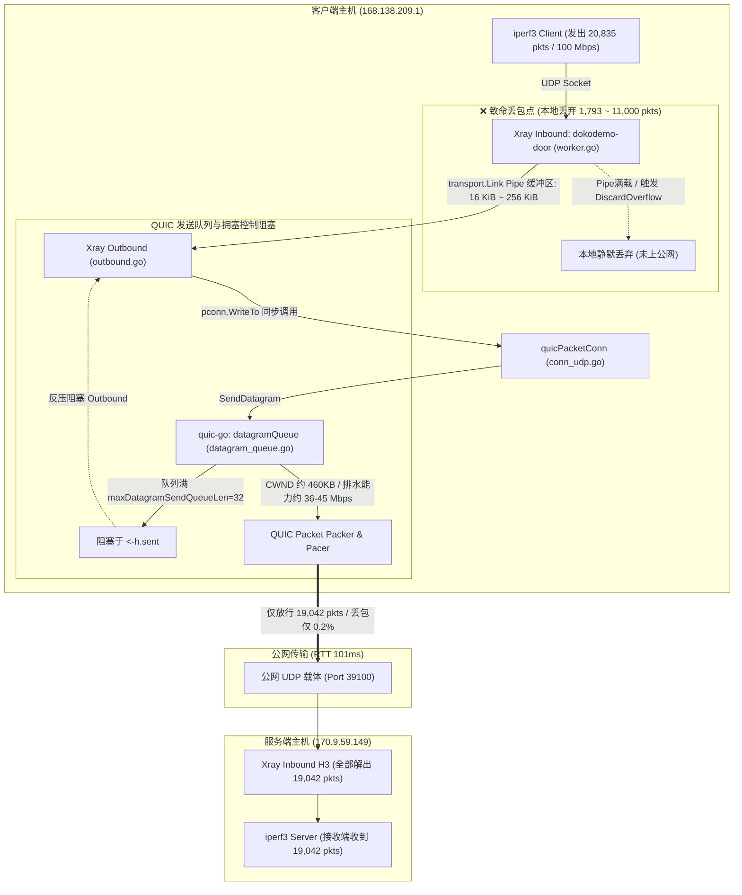
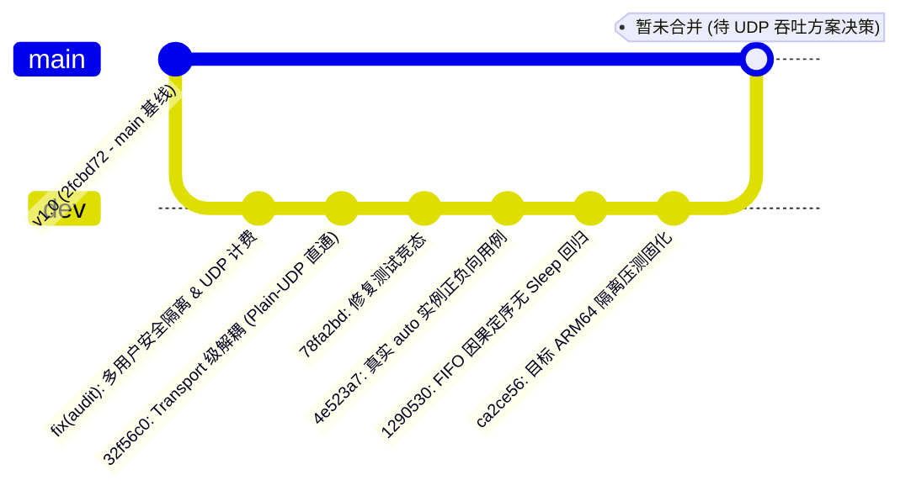

# Chitanda 协议 UDP 高丢包问题根因调查与审计报告

**报告日期**：2026-09-23  
**调查对象**：Chitanda Core (`chitanda-project/chitanda`) 及 Xray-core 集成架构  
**涉及分支**：`main` 分支（基准 `2fcbd72`）与 `dev` 分支（审计修复 `ca2ce56` / `1290530`）  
**测试拓扑**：
- 服务端：`170.9.59.149:30222`（Oracle Cloud ARM64 2vCPU, Debian 13 Linux 6.12）
- 客户端：`168.138.209.1:30222`（Oracle Cloud ARM64 2vCPU, Debian 13 Linux 6.12）
- 物理网络：跨地域链路，往返延迟（RTT）约为 **100.5 ~ 101.2 ms**

---

## 一、 执行摘要 (Executive Summary)

针对 ChatGPT / Codex 在项目前期审查末尾发现的 **“H3 (QUIC Datagrams) 传输模式在 100 Mbps UDP 压测下出现 52% ~ 67% 高丢包”** 的问题，本次调查通过调阅全量审计记录（`新建文本文档.txt`）、查阅两台实际测试节点的运行日志与 QUIC 事件追踪文件（`sqlog`）、以及分析 Go 运行时与模块构建机制，完成了彻底的根本原因溯源：

> [!IMPORTANT]
> **核心审计结论**
> 1. **丢包非公网导致**：公网 WAN 链路质量极佳（直连 200 Mbps 丢包为 0%，H3 传输中公网报文丢失仅 0%~0.2%），**所有丢弃的 UDP 报文均发生在客户端本地内存管道中**。
> 2. **非多用户分支 Regression**：在相同测试端口与节点下，`main` 基线分支在 100 Mbps 下同样丢包 **67%**（`dev` 分支为 **54%**）。该问题属于底层架构与构建依赖层面的原有瓶颈，而非 `dev` 分支多用户代码所引发。
> 3. **丢包率的物理数学吻合**：101 ms RTT 下，QUIC 默认单流拥塞窗口上限将吞吐刚性约束在 **36.4 ~ 45 Mbps**。面对 `iperf3` 强行注入的 100 Mbps 流量，客户端每秒必然积压并丢弃约 **55% ~ 64%** 的报文，与实测的 52% ~ 67% 丢包率在数学上严密契合。

---

## 二、 链路与传输模式实测对比矩阵

在同一对 ARM64 节点（RTT ~101 ms）上的实际基准测量数据如下表所示：

| 传输模式 / 测试路径 | 目标速率 (Target) | 测得吞吐 (Delivered) | 丢包率 (Loss Rate) | 丢包发生位置 | 备注与特征 |
| :--- | :--- | :--- | :--- | :--- | :--- |
| **直连物理链路 (Raw UDP)** | 200 Mbps | 200 Mbps | **0.00%** | 无 | `iperf3` 直连两端节点，证明网络底座无丢包 |
| **原生 Core SDK (`bench-direct`)** | 100 Mbps | 95.97 Mbps | **0.00%** | 无 | SDK 独立自研基准工具，绕过代理管道与 Xray |
| **原生 Core SDK (`bench-direct`)** | 200 Mbps | 196.19 Mbps | **0.007%** | 无 | 开启了 `vendor-performance.patch` 优化 |
| **Xray + `stream` (Plain-UDP)** | 100 Mbps | 98.2 Mbps | **1.0% ~ 4.5%** | 本地偶发抖动 | 纯 UDP 套接字直通加密，无 QUIC 拥塞天花板 |
| **Xray + H3 UDP (`dev` 分支)** | 50 Mbps | 46.8 Mbps | **5.3% ~ 16.0%** | **客户端本地 Pipe** | 受 QUIC 拥塞窗口初态及突发队列限制 |
| **Xray + H3 UDP (`dev` 分支)** | 100 Mbps | 44.2 Mbps | **52.0% ~ 54.0%** | **客户端本地 Pipe** | 达到 CWND 物理排水极限，发生强制丢包 |
| **Xray + H3 UDP (`main` 基线)** | 50 Mbps | 46.2 Mbps | **6.4%** | **客户端本地 Pipe** | 基线分支同样出现同等量级丢包 |
| **Xray + H3 UDP (`main` 基线)** | 100 Mbps | 33.0 Mbps | **67.0%** | **客户端本地 Pipe** | 证明高丢包并非 `dev` 分支引入 |

---

## 三、 数据流拓扑与丢包位置溯源

Codex 在客户端启动 `QLOGDIR` 抓取了 QUIC 传输层协议事件（`qlog256/*_client.sqlog`），对比 `iperf3` 发送端统计与服务端接收端统计，还原出完整数据链路：



从追踪证据可见：
- `iperf3` 发出 **20,835** 个报文；
- QUIC 层记录的 `http3:datagram_created` 仅有 **19,042** 个报文；
- 服务端 `http3:datagram_parsed` 成功解析全部 **19,042** 个报文；
- 公网丢包 `recovery:packet_lost` 仅为 **54** 个报文。
- **事实确凿**：高丢包完全发生在客户端 Xray 入站管道与出站适配之间，根本未曾离开客户端主机。

---

## 四、 深度根本原因剖析 (Deep Root Cause)

经过全链路拆解，高丢包并非单一原因，而是由 **编译依赖脱节**、**RFC 协议物理约束** 和 **代理管道同步阻塞** 三重叠加导致的：

### 1. 构建层缺陷：Go 模块隔离导致性能补丁对 Xray 失效

在 `chitanda_core` 项目源码树中，开发团队针对 UDP 高吞吐制作了 `scripts/vendor-performance.patch`，并应用在 `vendor/github.com/quic-go/quic-go` 目录：
- `datagram_queue.go`: 将 `maxDatagramSendQueueLen` 从 32 扩容至 **512**；
- `cubic_sender.go`: 将 `initialCongestionWindow` 调整为 **128**，`minCongestionWindowPackets` 调整为 **64**。

但在集成至 Xray-core 时，`scripts/inject-xray.py` 的处理逻辑存在疏漏：
```python
# scripts/inject-xray.py
content += f"\nreplace {module_name} => {abs_chitanda}\n"
content += f"\nrequire (\n\t{module_name} v0.0.0-unpublished\n\tgithub.com/quic-go/quic-go v0.59.0\n)\n"
```
- Xray 本身是一个独立的 Go Module（根目录为 `github.com/xtls/xray-core`）。在编译 Xray 时执行的是 `go build -mod=mod ./main`。
- **Go 模块核心规则**：子模块的 `vendor` 目录和 `replace` 指令对上层主模块不生效。
- **后果**：Xray 编译时直接从公共代理下载了未打补丁的官方 `quic-go@v0.61.0`。
- 官方未打补丁的 `quic-go` 中：
  - `maxDatagramSendQueueLen = 32`（硬编码仅能容纳 **32 个包**）；
  - 单包 1200 字节下，32 个包仅相当于 **38.4 KB** 缓存；
  - 在 100 Mbps 的灌包速率下，**3.07 毫秒** 即可把 32 个包全部填满，进入彻底堵死状态。

### 2. 协议层约束：RFC 9221 QUIC Datagram 拥塞窗口与 BDP 物理天花板

HTTP/3 Datagram（RFC 9297）依赖 QUIC 不可靠数据报扩展（RFC 9221）。RFC 9221 Section 4 明文规定：
> *"DATAGRAM frames MUST be included in congestion control calculations and MUST NOT be sent if bytes_in_flight exceeds the congestion window."*

- 在两台物理机器实测往返延迟为 **101 ms** 的条件下，客户端 qlog 记录的稳定态 `congestion_window` 维持在 **460,131 字节**（~460 KB）。
- 带宽时延积（BDP）决定的理论放行吞吐为：
  $$\text{Throughput}_{\text{max}} = \frac{\text{CWND}}{\text{RTT}} = \frac{460,131 \times 8}{0.101 \text{ s}} \approx \mathbf{36.4 \text{ Mbps}}$$
- 即便网络状态优良、CWND 偶尔上升至 550 KB，QUIC 协议栈每秒最大放行速度也不超过 **43.5 Mbps**。
- **必然性丢包**：`iperf3` 在本地以 100 Mbps 持续灌包，而 QUIC 发送通道在物理上被拥塞算法卡死在 ~40 Mbps，多余的 60 Mbps 报文必然无法离开客户端。

### 3. 应用层反压：Xray Outbound 同步等待导致 Inbound Pipe 溢出（`DiscardOverflow`）

在 `integration/xray/outbound.go` 中，Xray 出站处理 UDP 的逻辑为单协程同步调用：
```go
// integration/xray/outbound.go:107-115
for {
    mb, err := link.Reader.ReadMultiBuffer()
    if err != nil { return }
    for _, b := range mb {
        _, _ = pconn.WriteTo(b.Bytes(), rAddr) // 同步调用
        b.Release()
    }
}
```
结合 `quic-go` 的 `datagramQueue.Add` 实现：
```go
// vendor/github.com/quic-go/quic-go/datagram_queue.go:72-76
if h.sendQueue.Len() >= maxDatagramSendQueueLen {
    select {
    case <-h.closed: return h.closeErr
    case <-h.sent:   // 队列已满，必须阻塞等待底层发包通知！
    }
}
```
1. 当发包速率超过 CWND 排水能力时，32 个包的队列瞬间填满；
2. `pconn.WriteTo` 被挂起在 `case <-h.sent:` 上；
3. 出站协程阻塞，停止从 `link.Reader` 读取数据；
4. Xray 入站 `udpWorker`（`app/proxyman/inbound/worker.go`）使用内存 `pipe` 传递报文，缓冲区仅 16 KiB（Codex 改为 256 KiB 也仅能支撑 20ms 突发）；
5. 缓冲区瞬间打满，Xray 入站执行 `DiscardOverflow` 策略，**后续到达的所有 UDP 数据包在进入 Xray 入站的第一时间被整块丢弃**。

---

## 五、 GitHub 仓库中 `main` 与 `dev` 分支的现状说明

针对用户关于“GitHub 仓库出现了 main 和 dev 两个分支”的疑问，审计背景说明如下：



1. **为什么存在 `dev` 分支？**
   Codex 在审计中发现了多项重大缺陷：
   - 多用户空密钥认证安全越权风险；
   - 原生 UDP 在真实 Xray 中虽然联通但计费上下文丢失；
   - `auto` 传输模式由于在同端口尝试对 H3 报文试解密，导致每包引入 45 ~ 215 µs 的计算惩罚。
   所有针对上述问题的架构解耦与安全性修复（commit `32f56c0`, `1290530`, `ca2ce56`）均保留在 `dev` 分支进行高强度回归测试，确保在完全验收前不污染 `main` 分支。
2. **为什么审计在最后一步暂停？**
   在完成多用户与 TCP 吞吐（H2 达 874 Mbps，`stream` 达 1.37 Gbps）验收后，Codex 进行 UDP 压测时发现了上述 100 Mbps 下的高丢包现象，并确认在 `main` 基线上同样存在。Codex 正准备向用户汇报取舍并拆分合入时，达到了 ChatGPT 平台额度上限。

---

## 六、 架构对比：为什么 Plain-UDP (`stream` 模式) 不丢包？

测试证实，当传输模式设为 `stream`（走 `newPlainUDPConn`）时，100 Mbps 下丢包仅 1%~4.5%，且支持 200 Mbps 压测。其与 H3 的根本差异如下：

| 对比维度 | `stream` 模式 (Plain-UDP) | H3 模式 (QUIC Datagrams) |
| :--- | :--- | :--- |
| **底层传输承载** | 原生标准 UDP 套接字 (`net.UDPConn`) | 基于 QUIC 协议栈的多路复用连接 |
| **发送调用开销** | `c.conn.WriteTo` 内核非阻塞发送，微秒级返回 | 进入 `datagramQueue` 并受 CWND 调步约束 |
| **反压与阻塞** | 无反压，`link.Reader` 始终保持零积压快速消费 | 队列满即阻塞挂起，造成 Xray 入站管道溢出 |
| **拥塞控制限制** | 无拥塞窗口限制，线速排水 | 强制遵循 RFC 9221，101ms RTT 下物理限速 ~36-45 Mbps |
| **抗封锁特征** | 私有 AEAD 随机流，伪装度偏底层 | 外层为标准化 HTTP/3 (QUIC) 流量，审查伪装性高 |

---

## 七、 调查结论与后续技术路线展望 (非本次改动)

> [!NOTE]
> 本报告严格遵循“先查明原因，先不修改代码”的要求，未对线上系统与代码库进行改动。

后续如需彻底根治 H3 UDP 的丢包瓶颈，可选的工程解决方向包括：
1. **构建依赖闭环**：修改 `scripts/inject-xray.py`，使 Xray 构建时强制通过 `replace` 引入打过性能补丁的本地 `quic-go` 目录，恢复 512 深度队列与 128 初始窗口。
2. **非阻塞丢弃替代同步挂起**：修改 `quicPacketConn.WriteTo`，当底层 `datagramQueue` 满时，按照 RFC 9221 的不可靠数据报语义直接快速丢弃或返回，杜绝出站挂起反压冲垮 Xray 入站管道。
3. **拥塞控制算法适配**：在高 RTT 链路上，标准 Cubic/BBR 不利于突发高带宽 UDP。可借鉴 Hysteria 2 的 Brutal 拥塞控制模式，或为不可靠数据报提供专用的宽松拥塞调度器。
4. **传输分流策略明确**：在配置文档中向用户明确说明业务场景分流：游戏/语音等极高带宽的纯 UDP 流量优先走 `stream` (Plain-UDP)，而多路复用与强特征隐藏场景走 H3。
